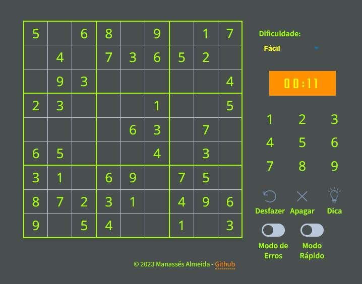

# Nanpure 
deploy   https://nanpure.vercel.app/

Um jogo Nanpure (Sudoku) em React!

Nesta aplicação, vamos mostrar a utilização do React para criar um jogo e gerenciar todas as informações importantes em um único lugar. Temos um lugar central onde guardamos todas as informações do jogo. Isso torna mais simples atualizar as diferentes partes do jogo de acordo com as mudanças que acontecem ao longo do tempo.

Usando o React vamos construir nosso jogo de forma mais organizada e fácil de entender. Com essa abordagem, podemos modificar o jogo de forma mais simples, garantindo que todas as partes dele fiquem sempre sincronizadas e atualizadas. O objetivo é proporcionar uma experiência divertida e prática para quem está nos estágios iniciais de React e, ao mesmo tempo, aprender a utilizar essa biblioteca front-end para desenvolver projetos interativos e dinâmicos. Vamos em frente e divirta-se!

Características principais:

* Apenas componentes funcionais!
* useEffect, ganchos useState em vez de state.
* Uso simples de `props`.
* Toda a lógica do jogo reside em um único componente.
* Use as propriedades personalizadas do CSS para manter a folha de estilo DRY.
* Entenda como as funções podem ser enviadas como `props` e consumidas.
* Typescript para verificação de tipo estático!

------------------------------- INSTRUÇÕES SOBRE O GAME ----------------------------------------------------

O Nanpure (Sudoku) é um quebra-cabeça numérico que consiste em uma grade 9x9 dividida em nove subgrades 3x3, chamadas de regiões. O objetivo do jogo é preencher todas as células vazias da grade com números de 1 a 9, seguindo algumas regras simples:

Cada número de 1 a 9 deve aparecer apenas uma vez em cada linha.
Cada número de 1 a 9 deve aparecer apenas uma vez em cada coluna.
Cada número de 1 a 9 deve aparecer apenas uma vez em cada região 3x3.
Um Sudoku começa com algumas células já preenchidas, formando um padrão inicial. Essas células preenchidas são chamadas de "dicas" ou "números dados". O jogador deve usar as dicas fornecidas e a lógica para completar o restante da grade, seguindo as regras mencionadas acima.

Para resolver o Nanpure, os iniciantes podem começar procurando por números que só podem ser colocados em uma posição específica na linha, coluna ou região 3x3. Em seguida, devem continuar a deduzir os números restantes até completar o quebra-cabeça.
